# Custom ComfyUI Nodes

This repository contains custom nodes for ComfyUI that extend functionality for workflows.

## Available Nodes

### Text Processing Nodes

#### 1. Variable builder [darkilNodes]
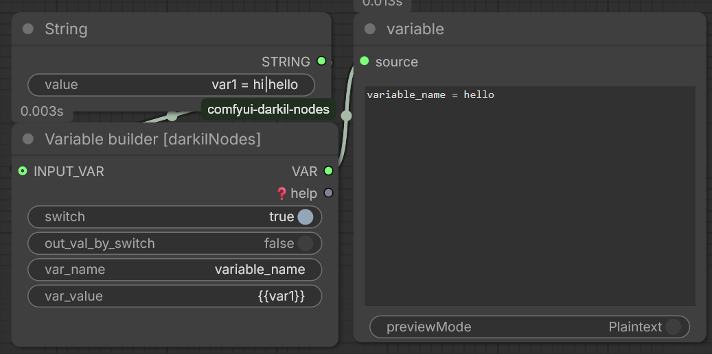
- **Category**: darkilNodes/text
- **Description**: Builds text variables from multiple inputs with configurable formatting.
- **Features**:
  - Supports multiple input types (text, integers, floats)
  - Configurable separators and prefixes/suffixes
  - Conditional output based on input presence
- **Inputs**:
  - `switch` (BOOL): node active toggle
  - `out_val_by_switch` (BOOL): return if active
  - `var_name` (STRING): variable name 
  - `var_value` (STRING): variable value
  - `INPUT_VAR` (STRING): other variables input

#### 2. Advanced variable builder [darkilNodes]
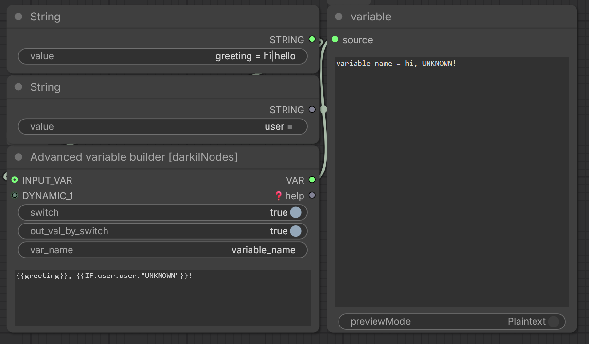
- **Category**: darkilNodes/text
- **Description**: Advanced text variable builder with complex formatting options.
- **Features**:
  - Supports multiple input types with custom formatting
  - Configurable separators and prefixes/suffixes
  - Conditional output based on input presence
  - Customizable number formatting for integers and floats
- **Inputs**:
  - `switch` (BOOL): node active toggle
  - `out_val_by_switch` (BOOL): return if active
  - `var_name` (STRING): variable name 
  - `var_text` (STRING): variable value
  - `INPUT_VAR` (STRING): other variables input
  - `DYNAMIC_*` (STRING): dynamic inputs
  - `condition` (BOOLEAN): When True, outputs only if inputs are present
  - `int_format` (STRING): Format string for integers
  - `float_format` (STRING): Format string for floats

#### 3. Dynamic prompt builder [darkilNodes]
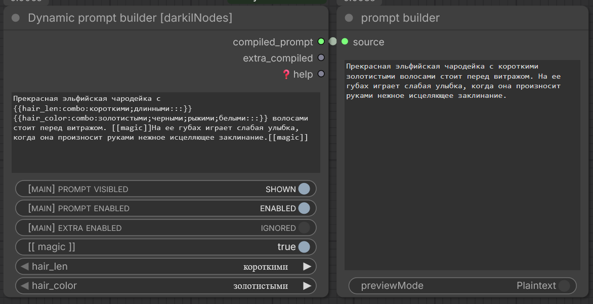
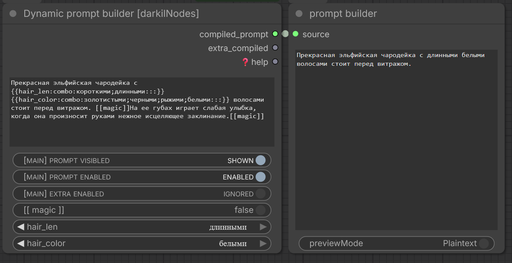
- **Category**: darkilNodes/text
- **Description**: Dynamically builds prompts from text inputs with various formatting options.
- **Features**:
  - Supports multiple input types (text, integers, floats)
  - Configurable separators and prefixes/suffixes
  - Conditional output based on input presence
  - Automatic handling of empty/whitespace inputs
- **Inputs**:
  - `text` (STRING): Text input to process
  - `PROMPT VISIBLED` (BOOL): text widget visible
  - `PROMPT ENABLED` (BOOL): compiled_prompt output active
  - `EXTRA ENABLED` (BOOL): extra_compiled output active


#### 4. Text is empty [darkilNodes]
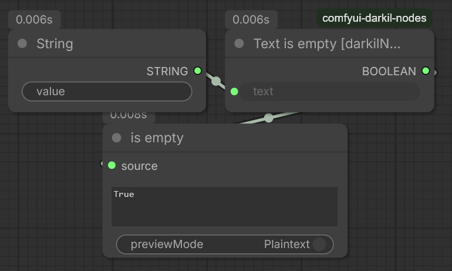
- **Category**: darkilNodes/text
- **Description**: Checks if a text string is empty or contains only whitespace.
- **Inputs**:
  - `text` (STRING): The text to check
- **Outputs**:
  - `BOOLEAN`: True if the text is empty, False otherwise

#### 5. Text not empty [darkilNodes]
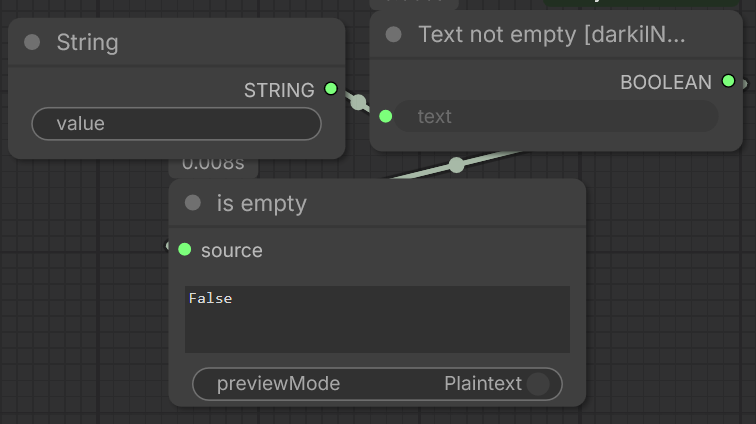
- **Category**: darkilNodes/text
- **Description**: Checks if a text string contains content.
- **Inputs**:
  - `text` (STRING): The text to check
- **Outputs**:
  - `BOOLEAN`: True if the text is not empty, False otherwise

#### 6. Text lines count [darkilNodes]
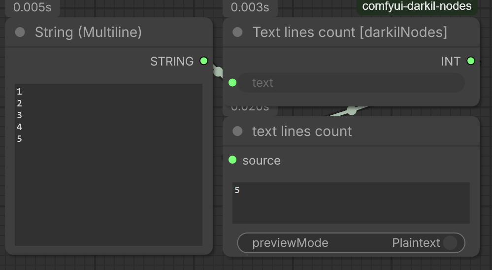
- **Category**: darkilNodes/text
- **Description**: Counts the number of lines in a text string.
- **Inputs**:
  - `text` (STRING): The text to count lines for
- **Outputs**:
  - `INT`: Number of lines in the text

### Logic Nodes

#### 1. Multi toggles [darkilNodes]
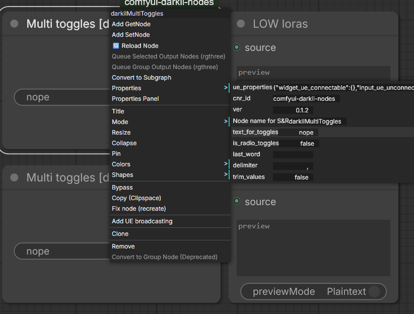
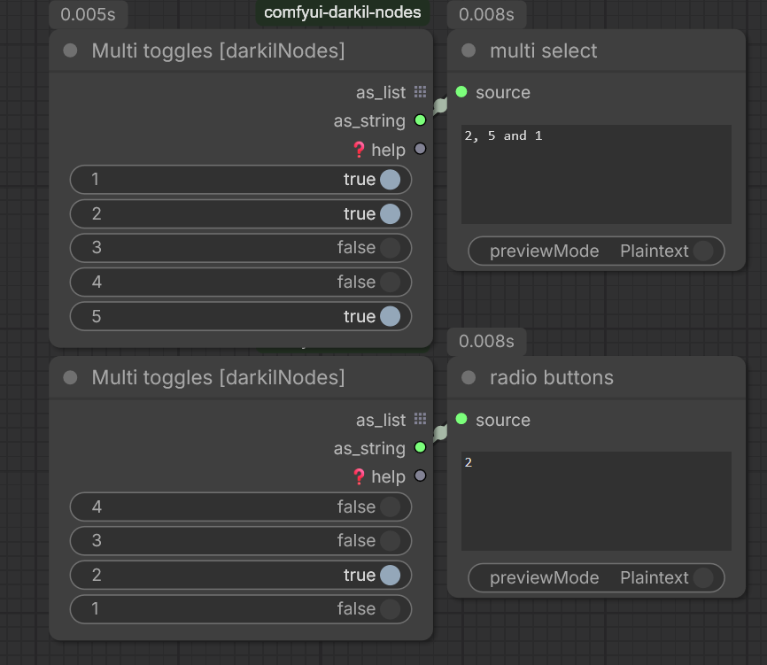
- **Category**: darkilNodes/logic
- **Description**: Provides multiple toggle switches for selecting options.
- **Features**:
  - Configurable via node properties
  - Supports radio button behavior
  - Customizable delimiter and last word for string joining
- **UI Configuration Properties**:
  - `text_for_toggles`: Defines toggle options (semicolon or pipe separated)
  - `is_radio_toggles`: Enables radio button behavior
  - `trim_values`: Trims whitespace from values
  - `last_word`: Custom word before final item in joined string
  - `delimiter`: String used to join items

#### 2. Custom combo box [darkilNodes]
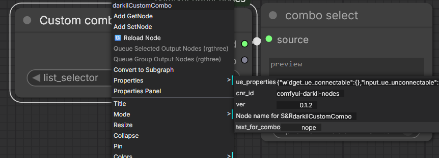
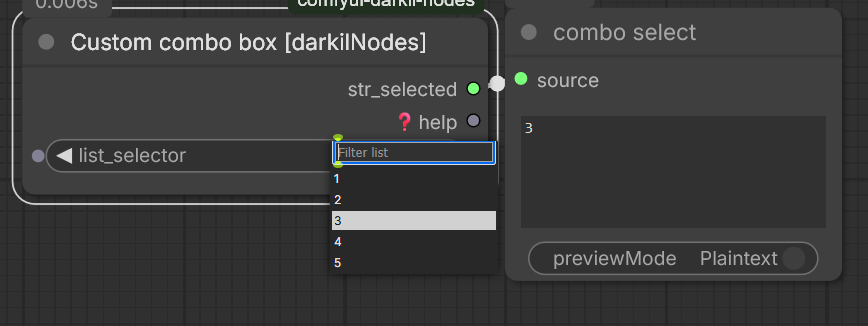
- **Category**: darkilNodes/logic
- **Description**: Allows selection from a custom combo list.
- **Features**:
  - Configurable via node properties
  - Supports semicolon or pipe separated items
  - Outputs selected value and help text
- **UI Configuration Properties**:
  - `text_for_combo`: List of items (semicolon or pipe separated)

### LoRA Nodes

#### 1. LoRA list for WanVideoWrapper by Kijai [darkilNodes]
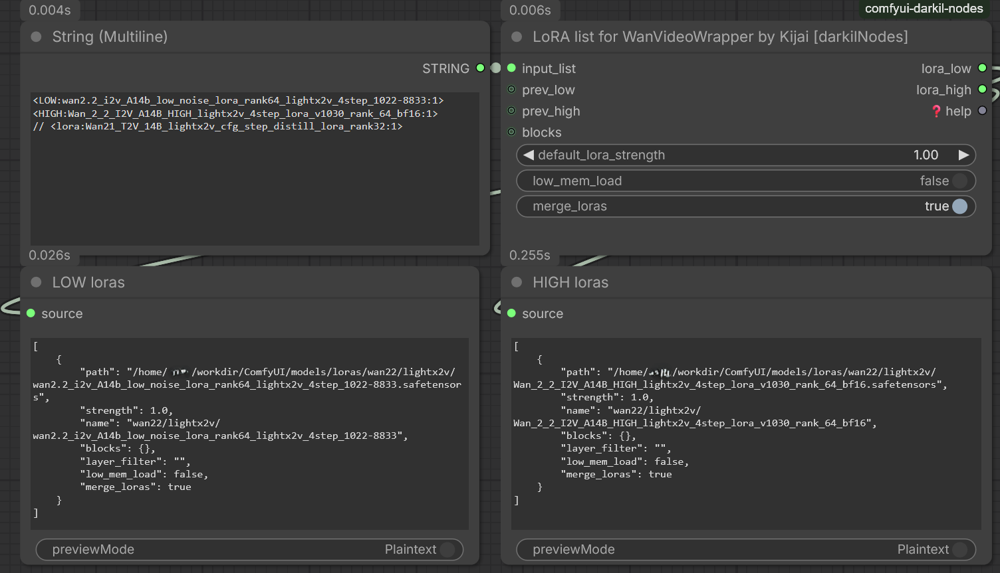
- **Category**: darkilNodes/lora
- **Description**: Parses textual lists of LoRA definitions for WanVideoWrapper nodes by Kijai.
- **Features**:
  - Supports multiple input formats (newlines, semicolons, pipes)
  - Handles comments (both line and block style)
  - Low/high noise model targeting with prefixes
  - Block selection support
  - Merging of LoRAs for efficiency
  - Previous list merging capability
- **Input Format**:
  - `<LoRA name>[:<strength>]`
  - Prefixes: `l<<`, `l<`, `<low:`, `low:` for low-noise model, `h<<`, `h<`, `<high:`, `high:` for high-noise model
- **Special Features**:
  - Supports block comments `/* ... */` and line comments `// ...`
  - Optional merging of multiple LoRAs into a single tensor
  - Low-memory loading option
  - Automatic handling of missing files with error logging

### File Handling Nodes

#### 1. Files list from dir [darkilNodes]
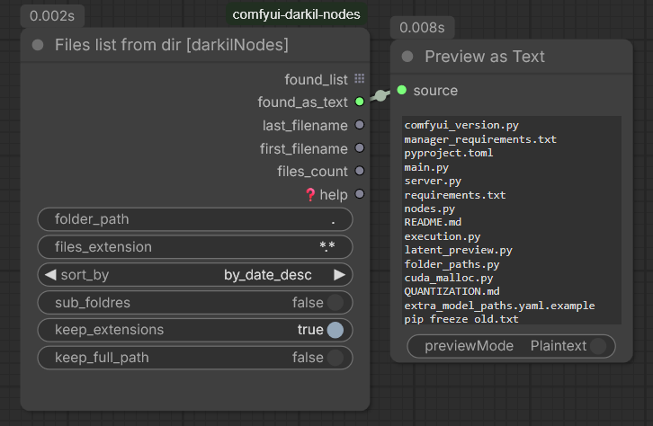
- **Category**: darkilNodes/files
- **Description**: Lists files in a directory based on extension and sorting criteria.
- **Features**:
  - Supports glob patterns for file filtering
  - Multiple sorting options (by date, name, size)
  - Recursive subdirectory search capability
  - Configurable output format (with/without extensions, full paths)
- **Inputs**:
  - `folder_path` (STRING): Path to the directory to scan
  - `files_extension` (STRING): Extension filter; can be a simple extension (e.g., "png") or any glob pattern (e.g., "*.txt")
  - `sort_by` (COMBO): Sorting method – by date, name, size and their descending variants
  - `sub_foldres` (BOOLEAN): If true, search recursively in sub-folders
  - `keep_extensions` (BOOLEAN): Keep file extensions in the output names
  - `keep_full_path` (BOOLEAN): Return full absolute paths instead of just filenames
- **Outputs**:
  - `found_list` (STRING): List of file names/paths
  - `found_as_text` (STRING): Newline-separated string of all files
  - `last_filename` (STRING): Name/path of the last file after sorting
  - `first_filename` (STRING): Name/path of the first file after sorting
  - `files_count` (INT): Total number of files found

## Installation

1. Clone or download this repository into your ComfyUI custom_nodes folder:
   ```
   cd ComfyUI/custom_nodes
   git clone https://github.com/yourusername/comfyui-custom-nodes.git
   ```

2. Install any required dependencies (if applicable):
   ```
   pip install -r requirements.txt
   ```

3. Restart ComfyUI to load the new nodes.

## Usage Examples

### Text Processing Example
```
TextIsEmpty → Boolean Switch
TextNotEmpty → Boolean Switch  
TextLinesCount → Integer Display
```

### LoRA Management Example
```
Wan22VideoLoraListBuilder → WanVideoWrapper (Kijai)
```

## License

MIT License - see LICENSE file for details.