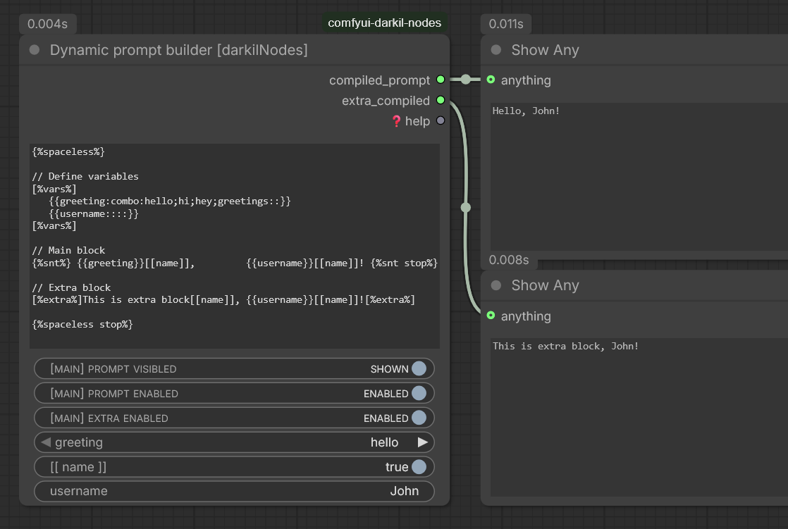

> [!NOTE]
> `comfyui-darkil-nodes` - various custom nodes for improved usability.

 

 

## Nodes:

#### Text

- **Variable builder**: Builds variables from text input.
- **Advanced variable builder**: Advanced version of variable builder with additional features.
- **Dynamic prompt builder**: Builds dynamic prompts based on input.
- **Text is empty**: Checks if the input text is empty.
- **Text not empty**: Checks if the input text is not empty.
- **Text lines count**: Counts the number of lines in the input text.

#### Logic
- **Multi toggles**: Provides multiple toggle switches for controlling various parameters.
- **Custom combo box**: Customizable combo box for selecting options.

#### LoRA
- **LoRA list for WanVideoWrapper by Kijai**: Builds a list of LoRA models for [WanVideoWrapper by Kijai]
(https://github.com/kijai/ComfyUI-WanVideoWrapper).

#### Files
- **Files list from dir**: Lists files from a specified directory.

