# Custom ComfyUI Nodes

This repository contains custom nodes for ComfyUI that extend functionality for workflows.

## Available Nodes

### Text Processing Nodes

#### 1. Variable builder [darkilNodes]
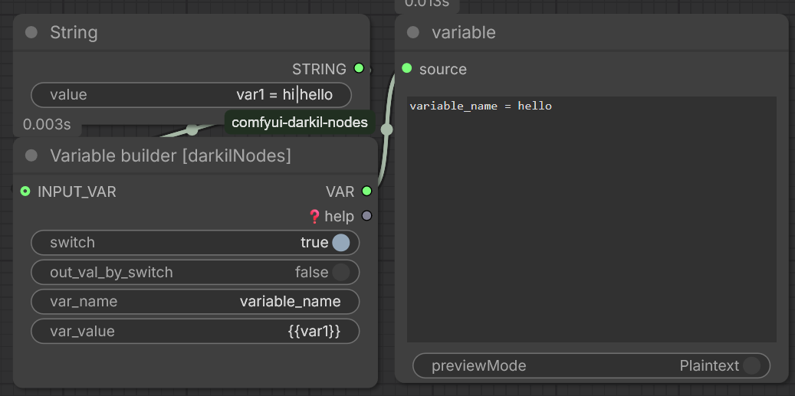
- **Category**: darkilNodes/text
- **Description**: Builds text variables from multiple inputs with configurable formatting.
- **Features**:
  - Supports multiple input types (text, integers, floats)
  - Configurable separators and prefixes/suffixes
  - Conditional output based on input presence
- **Inputs**:
  - `switch` (BOOL): node active toggle
  - `out_val_by_switch` (BOOL): return if active
  - `var_name` (STRING): variable name 
  - `var_value` (STRING): variable value
  - `INPUT_VAR` (STRING): other variables input

#### 2. Advanced variable builder [darkilNodes]
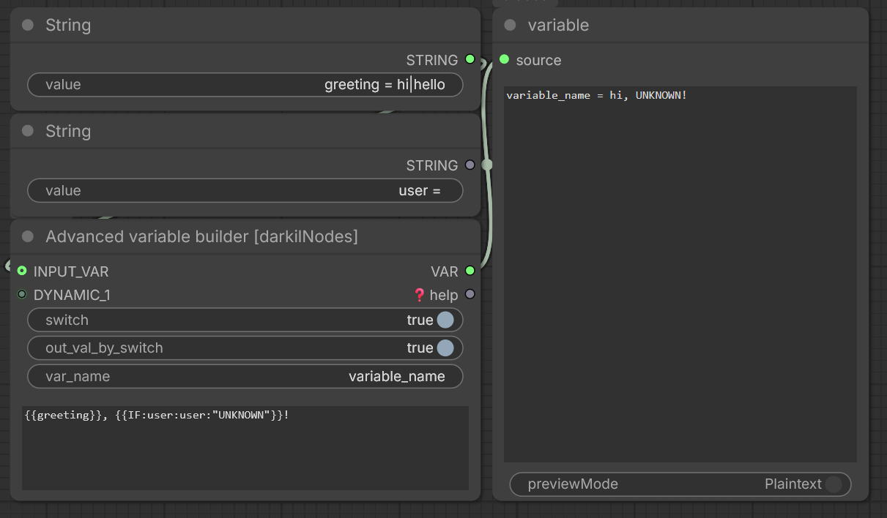
- **Category**: darkilNodes/text
- **Description**: Advanced text variable builder with complex formatting options.
- **Features**:
  - Supports multiple input types with custom formatting
  - Configurable separators and prefixes/suffixes
  - Conditional output based on input presence
  - Customizable number formatting for integers and floats
- **Inputs**:
  - `switch` (BOOL): node active toggle
  - `out_val_by_switch` (BOOL): return if active
  - `var_name` (STRING): variable name 
  - `var_text` (STRING): variable value
  - `INPUT_VAR` (STRING): other variables input
  - `DYNAMIC_*` (STRING): dynamic inputs
  - `condition` (BOOLEAN): When True, outputs only if inputs are present
  - `int_format` (STRING): Format string for integers
  - `float_format` (STRING): Format string for floats

#### 3. Dynamic prompt builder [darkilNodes]
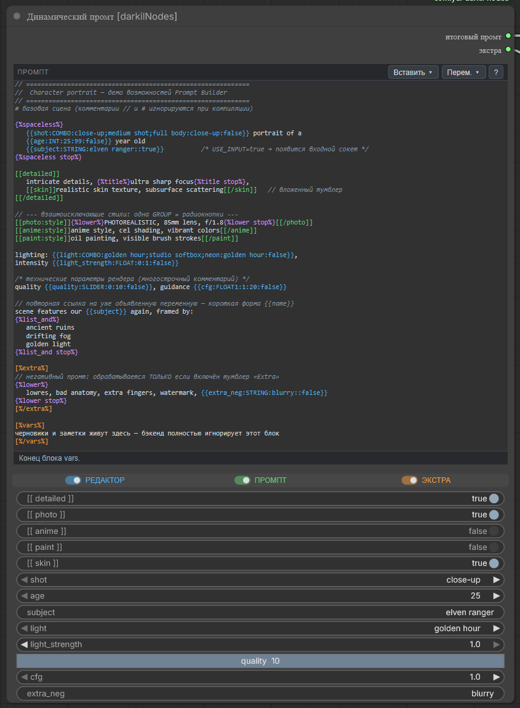
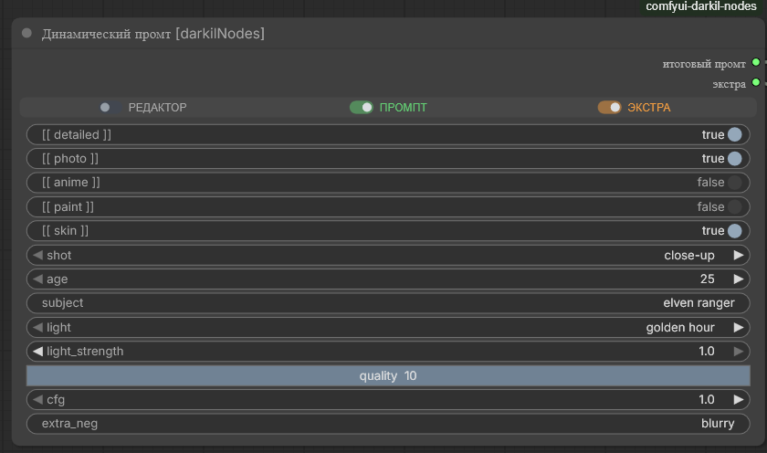
- **Category**: darkilNodes/text
- **Description**: Dynamically builds prompts from text inputs with various formatting options.
- **Features**:
  - Supports multiple input types (text, integers, floats)
  - Configurable separators and prefixes/suffixes
  - Conditional output based on input presence
  - Automatic handling of empty/whitespace inputs
- **Inputs**:
  - `text` (STRING): Text input to process
  - `PROMPT VISIBLED` (BOOL): text widget visible
  - `PROMPT ENABLED` (BOOL): compiled_prompt output active
  - `EXTRA ENABLED` (BOOL): extra_compiled output active


#### 4. Text is empty [darkilNodes]
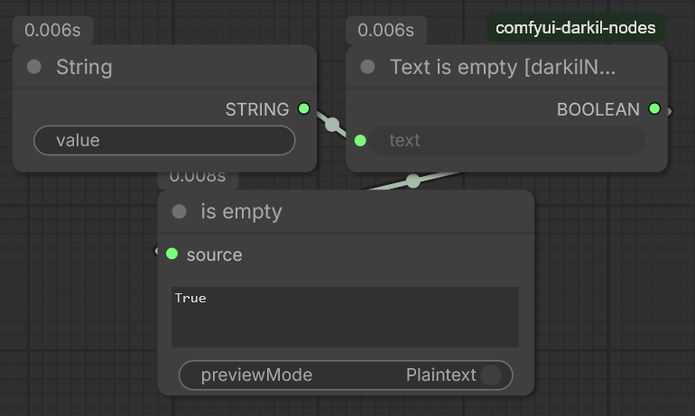
- **Category**: darkilNodes/text
- **Description**: Checks if a text string is empty or contains only whitespace.
- **Inputs**:
  - `text` (STRING): The text to check
- **Outputs**:
  - `BOOLEAN`: True if the text is empty, False otherwise

#### 5. Text not empty [darkilNodes]
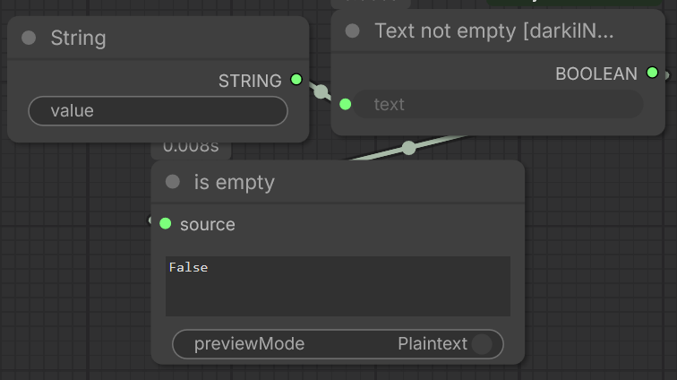
- **Category**: darkilNodes/text
- **Description**: Checks if a text string contains content.
- **Inputs**:
  - `text` (STRING): The text to check
- **Outputs**:
  - `BOOLEAN`: True if the text is not empty, False otherwise

#### 6. Text lines count [darkilNodes]
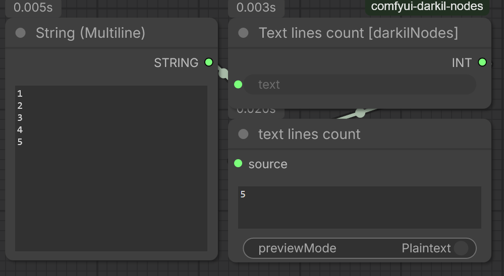
- **Category**: darkilNodes/text
- **Description**: Counts the number of lines in a text string.
- **Inputs**:
  - `text` (STRING): The text to count lines for
- **Outputs**:
  - `INT`: Number of lines in the text

#### 7. Strings Joiner [darkilNodes]
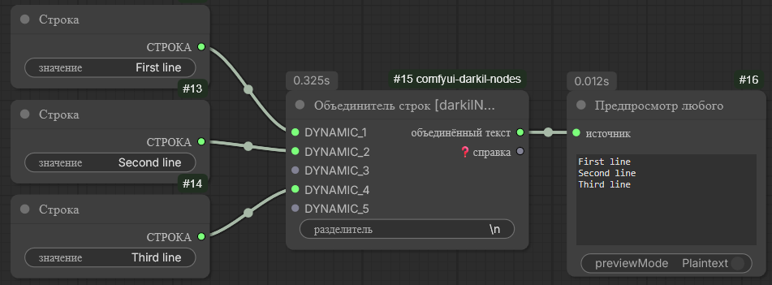
- **Category**: darkilNodes/text
- **Description**: Joins multiple text inputs with a specified separator.
- **Features**:
  - Supports dynamic number of text inputs via DYNAMIC_* slots
  - Escape sequence support (\n for newline, \t for tab)
  - Filters empty/None values before joining
- **Inputs**:
  - `joiner`: Separator string used to join texts (supports escape sequences)
  - `DYNAMIC_*`: Dynamic text inputs to join
- **Outputs**:
  - `joined_text`: Combined text with joiner as separator

### Logic Nodes

#### 1. Multi toggles [darkilNodes]
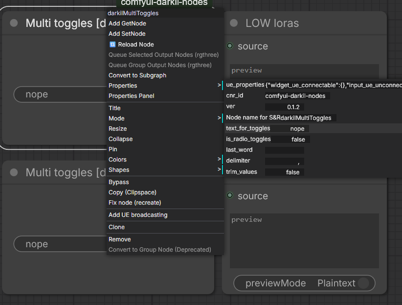
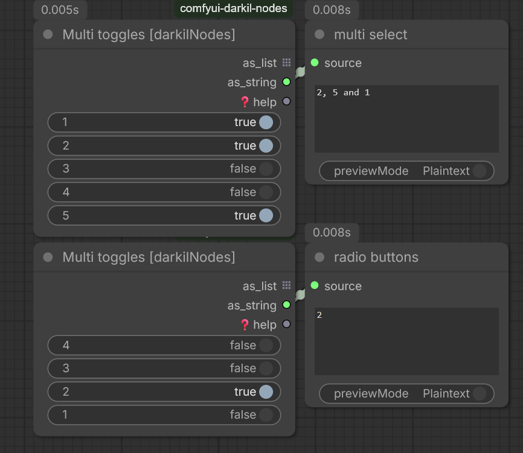
- **Category**: darkilNodes/logic
- **Description**: Provides multiple toggle switches for selecting options.
- **Features**:
  - Configurable via node properties
  - Supports radio button behavior
  - Customizable delimiter and last word for string joining
- **UI Configuration Properties**:
  - `text_for_toggles`: Defines toggle options (semicolon or pipe separated)
  - `is_radio_toggles`: Enables radio button behavior
  - `trim_values`: Trims whitespace from values
  - `last_word`: Custom word before final item in joined string
  - `delimiter`: String used to join items

#### 2. Custom combo box [darkilNodes]
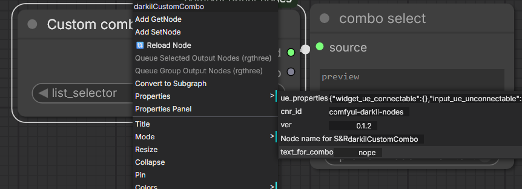
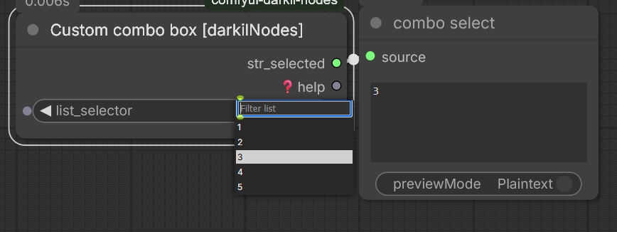
- **Category**: darkilNodes/logic
- **Description**: Allows selection from a custom combo list.
- **Features**:
  - Configurable via node properties
  - Supports semicolon or pipe separated items
  - Outputs selected value and help text
- **UI Configuration Properties**:
  - `text_for_combo`: List of items (semicolon or pipe separated)

#### 3. Diffusion model loader later [darkilNodes]
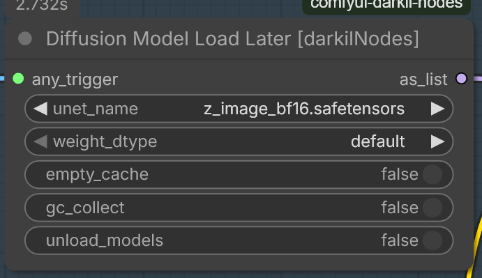
- **Category**: darkilNodes/logic
- **Description**: Loads the diffusion model into memory later.
- **Features**:
  - Allows you to connect the loader of the model along the chain, in the scheme
  - Allows you to clear the model cache
  - Allows you to unload models from memory
- **UI Configuration Properties**:
  - `any_trigger`: any type as a trigger for loading the diffusion model
  - `empty_cache`: clears the ComfyUI cache if enabled
  - `gc_collect`: <python> gc.collect()
  - `unload_models`: unloads previously loaded models into memory if enabled

#### 4. Multi Set [darkilNodes]
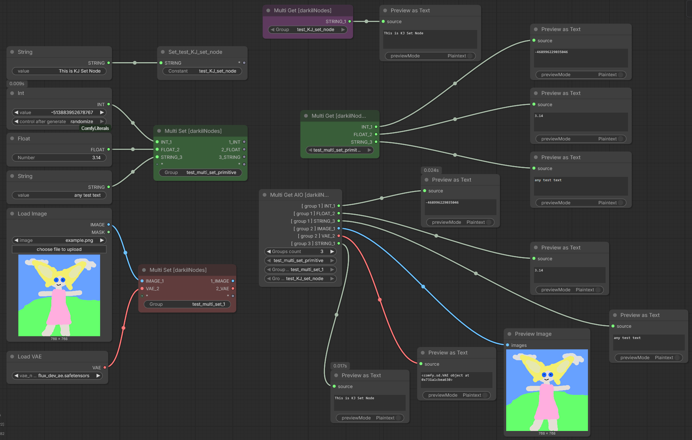
- **Category**: darkilNodes/logic
- **Description**: Creates a named *group* that dynamically generates matching input and output slots.
- **Features**:
  - Define a group name via widget; the name is kept unique across the graph.
  - When an input slot is connected, the node automatically creates a corresponding output slot with matching type and a generated name (`<type>_<index>`).
  - Supports a wildcard placeholder pair that is always kept free for further connections; extra placeholders are removed automatically.
  - Works with both native Multi Set nodes and KJNodes `SetNode` (compatibility mode).
  - Propagates color changes to linked Get nodes.
  - Virtual node – does not affect prompt serialization.

#### 5. Multi Get [darkilNodes]
- **Category**: darkilNodes/logic
- **Description**: Reads a *group* created by a Multi Set node and generates matching output slots dynamically.
- **Features**:
  - Group selector combo box populated with all existing Multi Set groups in the current graph.
  - Automatically rebuilds its outputs to mirror the inputs of the associated Multi Set node (type, order, naming).
  - Preserves existing connections when the group changes or when slots are added/removed.
  - Validates links to avoid type mismatches.
  - Synchronizes node colour with its corresponding Multi Set node.

#### 6. Multi Get AIO [darkilNodes]
- **Category**: darkilNodes/logic
- **Description**: An “All‑In‑One” version of Multi Get that can pull data from multiple groups at once.
- **Features**:
  - Widget to set the number of groups (1–100) and a combo box for each group to select an existing Multi Set group.
  - Generates output slots for every input of every selected group, naming them as `<type>_<index> [ <group_index> ]`.
  - Maintains connections across re‑configuration by mapping old outputs to new ones based on group name and original input index.
  - Supports colour inheritance from each source Multi Set node.
  - Validates and cleans up broken links automatically.
  - Virtual node – does not affect prompt serialization.

#### 7. Constant setter [darkilNodes]
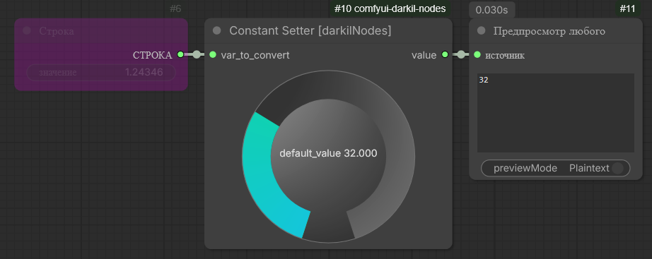
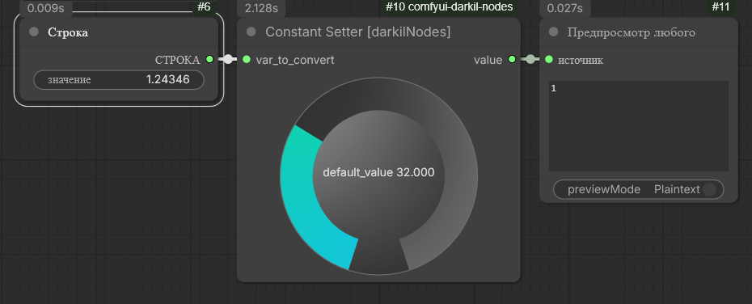
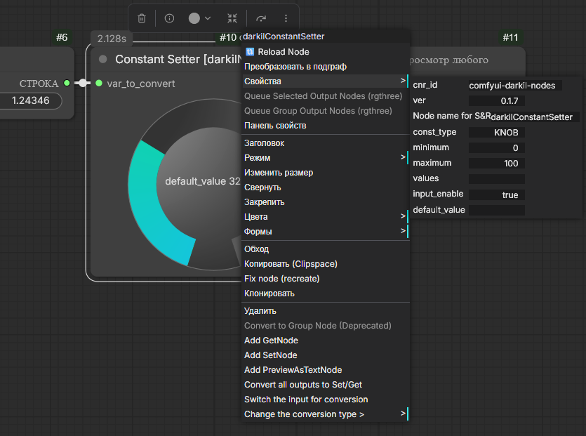
- **Category**: darkilNodes/logic
- **Description**: Sets a constant value of various types for use in workflows.
- **Features**:
  - Supports multiple data types: STRING, INT, FLOAT, BOOLEAN, COMBO
  - Slider/Knob controls with configurable min/max ranges
  - Type conversion from input values
  - Virtual node – does not affect prompt serialization
- **UI Configuration Properties**:
  - `const_type`: Data type (STRING, INT, FLOAT (FLOAT2-FLOAT5), BOOLEAN, COMBO, SLIDER (SLIDER2-SLIDER5), KNOB (KNOB2-KNOB5))
  - `default_value`: Default constant value
  - `minimum`, `maximum`: Range bounds for numeric types
  - `values`: Semicolon-separated list for COMBO type
  - `input_enable`: Enable input slot for value conversion

### LoRA Nodes

#### 1. LoRA list for WanVideoWrapper by Kijai [darkilNodes]
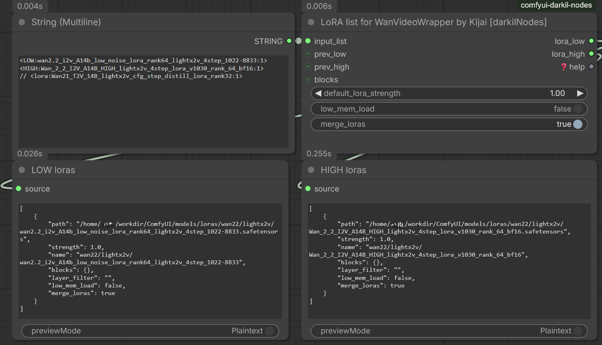
- **Category**: darkilNodes/lora
- **Description**: Parses textual lists of LoRA definitions for WanVideoWrapper nodes by Kijai.
- **Features**:
  - Supports multiple input formats (newlines, semicolons, pipes)
  - Handles comments (both line and block style)
  - Low/high noise model targeting with prefixes
  - Block selection support
  - Merging of LoRAs for efficiency
  - Previous list merging capability
- **Input Format**:
  - `<LoRA name>[:<strength>]`
  - Prefixes: `l<<`, `l<`, `<low:`, `low:` for low-noise model, `h<<`, `h<`, `<high:`, `high:` for high-noise model
- **Special Features**:
  - Supports block comments `/* ... */` and line comments `// ...`
  - Optional merging of multiple LoRAs into a single tensor
  - Low-memory loading option
  - Automatic handling of missing files with error logging

### File Handling Nodes

#### 1. Files list from dir [darkilNodes]
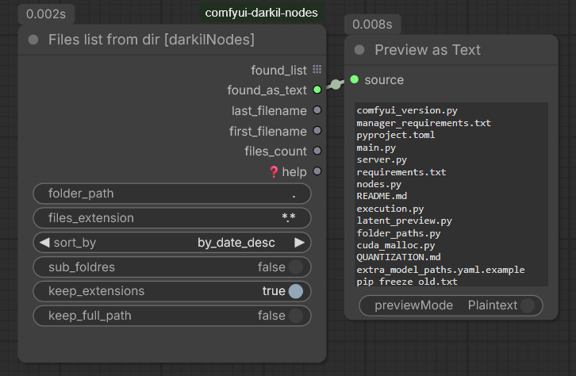
- **Category**: darkilNodes/files
- **Description**: Lists files in a directory based on extension and sorting criteria.
- **Features**:
  - Supports glob patterns for file filtering
  - Multiple sorting options (by date, name, size)
  - Recursive subdirectory search capability
  - Configurable output format (with/without extensions, full paths)
- **Inputs**:
  - `folder_path` (STRING): Path to the directory to scan
  - `files_extension` (STRING): Extension filter; can be a simple extension (e.g., "png") or any glob pattern (e.g., "*.txt")
  - `sort_by` (COMBO): Sorting method – by date, name, size and their descending variants
  - `sub_foldres` (BOOLEAN): If true, search recursively in sub-folders
  - `keep_extensions` (BOOLEAN): Keep file extensions in the output names
  - `keep_full_path` (BOOLEAN): Return full absolute paths instead of just filenames
- **Outputs**:
  - `found_list` (STRING): List of file names/paths
  - `found_as_text` (STRING): Newline-separated string of all files
  - `last_filename` (STRING): Name/path of the last file after sorting
  - `first_filename` (STRING): Name/path of the first file after sorting
  - `files_count` (INT): Total number of files found

## Installation

1. Clone or download this repository into your ComfyUI custom_nodes folder:
   ```
   cd ComfyUI/custom_nodes
   git clone https://github.com/pytraveler/comfyui-darkil-nodes.git
   ```

2. Restart ComfyUI to load the new nodes.

## Usage Examples

### LoRA Management Example
```
Wan22VideoLoraListBuilder → WanVideoSetLoRAs (Kijai)
```

## License

MIT License - see LICENSE file for details.
