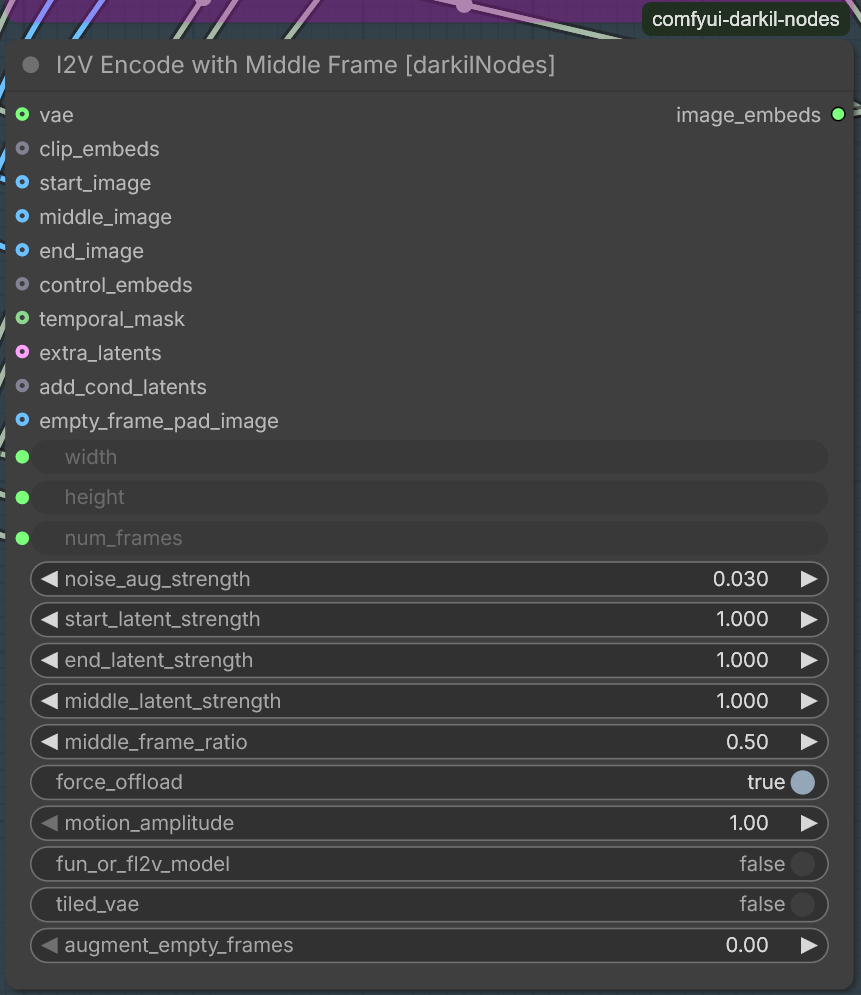
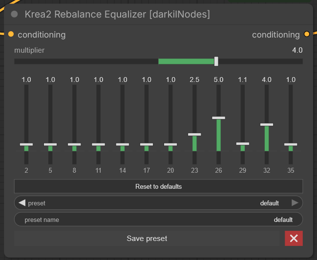

# Пользовательские узлы для ComfyUI

Языки: [English](README.md) · **Русский**

Этот репозиторий содержит пользовательские узлы для ComfyUI, расширяющие функциональность для рабочих процессов.

## Доступные узлы

### Узлы обработки текста

#### 1. Конструктор переменных [darkilNodes]

- **Категория**: darkilNodes/text
- **Описание**: Создает текстовые переменные из нескольких входных данных с настраиваемым форматированием.
- **Функции**:
  - Поддержка нескольких типов ввода (текст, целые числа, числа с плавающей запятой)
  - Настройка разделителей и префиксов/суффиксов
  - Условный вывод в зависимости от наличия входных данных
- **Входы**:
  - `switch` (BOOL): Переключатель активности узла
  - `out_val_by_switch` (BOOL): Выводить, если активно
  - `var_name` (STRING): Имя переменной
  - `var_value` (STRING): Значение переменной
  - `INPUT_VAR` (STRING): Другие переменные (вход)

#### 2. Расширенный конструктор переменных [darkilNodes]

- **Категория**: darkilNodes/text
- **Описание**: Расширенный конструктор текстовых переменных с продвинутыми опциями форматирования.
- **Функции**:
  - Поддержка нескольких типов ввода с пользовательским форматированием
  - Настройка разделителей и префиксов/суффиксов
  - Условный вывод в зависимости от наличия входных данных
  - Настройка форматирования целых и чисел с плавающей запятой
- **Входы**:
  - `switch` (BOOL): Переключатель активности узла
  - `out_val_by_switch` (BOOL): Выводить, если активно
  - `var_name` (STRING): Имя переменной
  - `var_text` (STRING): Значение переменной
  - `INPUT_VAR` (STRING): Другие переменные (вход)
  - `DYNAMIC_*` (STRING): Динамические входы
  - `condition` (BOOLEAN): Если True, выводится только при наличии входных данных
  - `int_format` (STRING): Строка формата для целых чисел
  - `float_format` (STRING): Строка формата для чисел с плавающей запятой

#### 3. Динамический конструктор промптов [darkilNodes]


- **Категория**: darkilNodes/text
- **Описание**: Строит промпт на основе небольшого шаблонного языка. Плейсхолдеры и теги-переключатели в тексте промпта создают на ноде соответствующие виджеты, поэтому один промпт можно перенастраивать «на лету», не редактируя текст.
- **Функции**:
  - **Плейсхолдеры** `{{NAME:TYPE:VALUE:DEFAULT:USE_INPUT}}` создают динамические виджеты. `TYPE` = STRING, INT, FLOAT, COMBO, SLIDER, KNOB; `USE_INPUT` (`true`) добавляет входной сокет для значения.
  - **Теги-переключатели** `[[TAG]]…[[/TAG]]` оставляют или удаляют обёрнутый блок по переключателю. `[[TAG:GROUP]]` делает теги с общей `GROUP` взаимоисключающими (поведение радиокнопок). Теги можно вкладывать.
  - **Блок extra** `[%extra%]…[%/extra%]` компилируется во второй выход; **блок vars** `[%vars%]…[%/vars%]` игнорируется бэкендом (заметки/черновик).
  - **Комментарии**, удаляемые до обработки: `// …`, `# …`, `/* … */`.
  - **Блоки без пробелов** `…` схлопывают пробелы, а **директивы форматирования** (`lower`, `upper`, `title`, `sentence`, `trim`, `dedent`, `list`, `list_and`, …) преобразуют обёрнутый текст и могут вкладываться.
  - **Редактор с подсветкой синтаксиса**: цветовая подсветка, меню *Вставить* / *Перем.*, подсказки по позиции курсора, подчёркивание ошибок и автодополнение с клавиатуры (локализация EN/RU).
  - **Компактная панель переключателей**: три переключателя в одну линию — **РЕДАКТОР** (показать/скрыть редактор), **ПРОМПТ** (обработка основного промпта), **ЭКСТРА** (обработка блока extra).
- **Входы**:
  - `prompt` (STRING, многострочный): шаблон промпта с плейсхолдерами, тегами, блоками и директивами
- **UI-переключатели** (клиентские, одна компактная строка):
  - **РЕДАКТОР**: показать/скрыть виджет редактора промпта
  - **ПРОМПТ**: включить/выключить обработку основного промпта (`compiled_prompt`)
  - **ЭКСТРА**: включить/выключить обработку блока extra (`extra_compiled`)
- **Выходы**:
  - `compiled_prompt` (STRING): обработанный основной промпт (пустой, когда **ПРОМПТ** выключен)
  - `extra_compiled` (STRING): обработанный блок extra (пустой, если отсутствует или **ЭКСТРА** выключен)

#### 4. Текст пустой [darkilNodes]

- **Категория**: darkilNodes/text
- **Описание**: Проверяет, является ли текстовая строка пустой или содержит только пробельные символы.
- **Входы**:
  - `text` (STRING): Текст для проверки
- **Выходы**:
  - `BOOLEAN`: True, если текст пустой, False в противном случае

#### 5. Текст не пустой [darkilNodes]

- **Категория**: darkilNodes/text
- **Описание**: Проверяет, содержит ли текстовую строку содержимое.
- **Входы**:
  - `text` (STRING): Текст для проверки
- **Выходы**:
  - `BOOLEAN`: True, если текст не пустой, False в противном случае

#### 6. Подсчет строк текста [darkilNodes]

- **Категория**: darkilNodes/text
- **Описание**: Подсчитывает количество строк в текстовой строке.
- **Входы**:
  - `text` (STRING): Текст для подсчета строк
- **Выходы**:
  - `INT`: Количество строк в тексте

#### 7. Объединитель строк [darkilNodes]

- **Категория**: darkilNodes/text
- **Описание**: Объединяет несколько текстовых входов с указанным разделителем.
- **Функции**:
  - Поддержка динамического количества текстовых входов через слоты DYNAMIC_*
  - Поддержка управляющих последовательностей (\n для переноса строки, \t для табуляции)
  - Фильтрация пустых значений и None перед объединением
- **Входы**:
  - `joiner`: Строка-разделитель для объединения текстов (поддерживает escape-последовательности)
  - `DYNAMIC_*`: Динамические текстовые входы для объединения
- **Выходы**:
  - `joined_text`: Результат объединения всех входных строк

### Логические узлы

#### 1. Множественные переключатели [darkilNodes]


- **Категория**: darkilNodes/logic
- **Описание**: Предоставляет несколько переключателей для выбора опций.
- **Функции**:
  - Настройка через свойства узла
  - Поддержка радиокнопок
  - Настройка разделителя и последнего слова для объединения строк
- **Свойства конфигурации интерфейса**:
  - `text_for_toggles`: Определяет варианты переключателей (разделенные точкой с запятой или вертикальной чертой)
  - `is_radio_toggles`: Включает режим радиокнопок
  - `trim_values`: Удаляет пробелы из значений
  - `last_word`: Пользовательское слово перед последним элементом в объединенной строке
  - `delimiter`: Строка, используемая для объединения элементов

#### 2. Пользовательский выпадающий список [darkilNodes]


- **Категория**: darkilNodes/logic
- **Описание**: Позволяет выбирать из пользовательского списка.
- **Функции**:
  - Настройка через свойства узла
  - Поддержка разделения элементов точкой с запятой или вертикальной чертой
  - Вывод выбранного значения и справочной информации
- **Свойства конфигурации интерфейса**:
  - `text_for_combo`: Список элементов (разделенные точкой с запятой или вертикальной чертой)

#### 3. Загрузить модель диффузии позже [darkilNodes]

- **Категория**: darkilNodes/logic
- **Описание**: Загружает модель диффузии в память позже в цепочке рабочего процесса.
- **Функции**:
  - Позволяет подключить загрузчик модели по цепочке
  - Позволяет очистить кэш модели
  - Позволяет выгружать модели из памяти
- **Входы**:
  - `any_trigger`: любой тип в качестве триггера для загрузки модели диффузии
  - `unet_name`: Имя модели диффузии для загрузки
  - `weight_dtype`: Тип данных весов (default, fp8_e4m3fn, fp8_e4m3fn_fast, fp8_e5m2)
  - `empty_cache`: очищает кэш ComfyUI, если включено
  - `gc_collect`: Python gc.collect()
  - `unload_models`: выгружает ранее загруженные модели из памяти

#### 4. Загрузить CLIP позже [darkilNodes]
- **Категория**: darkilNodes/logic
- **Описание**: Загружает модель CLIP в память позже в цепочке рабочего процесса.
- **Функции**:
  - Позволяет подключить загрузчик CLIP по цепочке выполнения
  - Поддержка очистки памяти
- **Входы**:
  - `any_trigger`: любой тип в качестве триггера для загрузки CLIP
  - Стандартные входы загрузчика CLIP (`clip_name`, `type`)
  - `empty_cache`: очищает кэш ComfyUI, если включено
  - `gc_collect`: Python gc.collect()
  - `unload_models`: выгружает ранее загруженные модели из памяти

#### 5. Загрузить DualCLIP позже [darkilNodes]
- **Категория**: darkilNodes/logic
- **Описание**: Загружает модель DualCLIP в память позже в цепочке рабочего процесса.
- **Функции**:
  - Позволяет подключить загрузчик DualCLIP по цепочке выполнения
  - Поддержка очистки памяти
- **Входы**:
  - `any_trigger`: любой тип в качестве триггера для загрузки DualCLIP
  - Стандартные входы загрузчика DualCLIP (`clip_name1`, `clip_name2`, `type`)
  - `empty_cache`: очищает кэш ComfyUI, если включено
  - `gc_collect`: Python gc.collect()
  - `unload_models`: выгружает ранее загруженные модели из памяти

#### 6. Загрузить VAE позже [darkilNodes]
- **Категория**: darkilNodes/logic
- **Описание**: Загружает модель VAE в память позже в цепочке рабочего процесса.
- **Функции**:
  - Позволяет подключить загрузчик VAE по цепочке выполнения
  - Поддержка очистки памяти
- **Входы**:
  - `any_trigger`: любой тип в качестве триггера для загрузки VAE
  - Стандартный вход загрузчика VAE (`vae_name`)
  - `empty_cache`: очищает кэш ComfyUI, если включено
  - `gc_collect`: Python gc.collect()
  - `unload_models`: выгружает ранее загруженные модели из памяти

#### 7. Multi Set [darkilNodes]

- **Категория**: darkilNodes/logic
- **Описание**: Создает именованную *группу*, которая динамически генерирует соответствующие входные и выходные слоты.
- **Особенности**:
  - Определите имя группы с помощью виджета; имя будет уникальным для всего графа.
  - При подключении входного слота узел автоматически создает соответствующий выходной слот с соответствующим типом и сгенерированным именем (`<тип>_<индекс>`).
  - Поддерживает пару заполнителей-джокеров, которая всегда остается свободной для дальнейших подключений; лишние заполнители удаляются автоматически.
  - Работает как с собственными узлами Multi Set, так и с узлами KJNodes `SetNode` (режим совместимости).
  - Изменение цвета распространяется на связанные узлы Get.
  - Виртуальный узел – не влияет на сериализацию промпта.

#### 8. Multi Get [darkilNodes]
- **Категория**: darkilNodes/logic
- **Описание**: Считывает *группу*, созданную узлом Multi Set, и динамически генерирует соответствующие выходные слоты.
- **Особенности**:
  - Поле со списком для выбора группы, заполненное всеми существующими группами Multi Set в текущем графе.
  - Автоматически перестраивает свои выходы таким образом, чтобы они отражали входы связанного узла Multi Set (тип, порядок, название).
  - Сохраняет существующие соединения при изменении группы или при добавлении/удалении слотов.
  - Проверяет ссылки, чтобы избежать несоответствия типов.
  - Синхронизирует цвет узла с соответствующим узлом Multi Set.

#### 9. Multi Get AIO [darkilNodes]
- **Категория**: darkilNodes/logic
- **Описание**: Универсальная версия Multi Get, которая может извлекать данные из нескольких групп одновременно.
- **Особенности**:
  - Виджет для установки количества групп (1–100) и поле со списком для каждой группы.
  - Генерирует выходные слоты для каждого входа каждой выбранной группы, называя их `<тип>_<индекс> [ <group_index> ]`.
  - Поддерживает соединения при повторной настройке, сопоставляя старые выходные данные с новыми на основе названия группы и исходного входного индекса.
  - Поддерживает наследование цвета от каждого исходного узла Multi Set.
  - Автоматически проверяет и удаляет неработающие ссылки.
  - Виртуальный узел – не влияет на сериализацию промпта.

#### 10. Установщик констант [darkilNodes]


- **Категория**: darkilNodes/logic
- **Описание**: Устанавливает постоянное значение различных типов для использования в рабочих процессах.
- **Функции**:
  - Поддержка нескольких типов данных: STRING, INT, FLOAT, BOOLEAN, COMBO
  - Элементы управления Slider/Knob с настраиваемыми диапазонами мин/макс
  - Преобразование типов из входных значений
  - Виртуальный узел – не влияет на сериализацию промпта
- **Свойства конфигурации интерфейса**:
  - `const_type`: Тип данных (STRING, INT, FLOAT (FLOAT2-FLOAT5), BOOLEAN, COMBO, SLIDER (SLIDER2-SLIDER5), KNOB (KNOB2-KNOB5))
  - `default_value`: Значение константы по умолчанию
  - `minimum`, `maximum`: Границы диапазона для числовых типов
  - `values`: Список через точку с запятой для типа COMBO
  - `input_enable`: Включить входной слот для преобразования значения

### Узлы WAN

#### 1. I2V Encode с средним кадром [darkilNodes]

- **Категория**: darkilNodes/wan
- **Описание**: Клон узла WanVideoWrapper 'WanVideo ImageToVideo Encode' с добавленной поддержкой среднего кадра. Собран из кода других проектов кастомных узлов.
- **Функции**:
  - Принимает start_image, middle_image (опционально) и end_image (опционально)
  - middle_frame_ratio управляет положением среднего кадра (0.0 = начало, 1.0 = конец)
  - middle_latent_strength управляет силой условия среднего кадра в латентном пространстве
  - motion_amplitude (>1.0) усиливает межкадровое движение
  - Поддержка аугментации шума, tiled VAE кодирования и заполнения пустых кадров
- **Основано на**:
  - [ComfyUI-Wan22FMLF](https://github.com/wallen0322/ComfyUI-Wan22FMLF)
  - [ComfyUI-PainterI2VforKJ](https://github.com/princepainter/ComfyUI-PainterI2VforKJ)
  - [ComfyUI-WanVideoWrapper](https://github.com/kijai/ComfyUI-WanVideoWrapper)
- **Входы**:
  - `width`, `height`, `num_frames`
  - `noise_aug_strength`, `start_latent_strength`, `end_latent_strength`, `middle_latent_strength`
  - `middle_frame_ratio`, `motion_amplitude`, `force_offload`
  - `vae` (WANVAE)
  - `start_image`, `middle_image`, `end_image`
  - `clip_embeds`, `control_embeds`, `temporal_mask`, `extra_latents`
  - `tiled_vae`, `fun_or_fl2v_model`, `augment_empty_frames`, `empty_frame_pad_image`
- **Выходы**:
  - `image_embeds` (WANVIDIMAGE_EMBEDS)

#### 2. Список LoRA для WanVideoWrapper от Kijai [darkilNodes]

- **Категория**: darkilNodes/wan
- **Описание**: Парсит текстовые списки определений LoRA для узлов WanVideoWrapper от Kijai.
- **Функции**:
  - Поддержка нескольких форматов ввода (новые строки, точки с запятой, вертикальные черты)
  - Обработка комментариев (как построчные, так и блочные)
  - Целевая настройка низко- и высокошумного модели с префиксами
  - Поддержка выбора блоков
  - Объединение LoRA для повышения эффективности
  - Возможность объединения предыдущего списка
- **Формат ввода**:
  - `<Имя LoRA>[:<сила>]`
  - Префиксы: `l<<`, `l<`, `<low:`, `low:` для низкошумной модели, `h<<`, `h<`, `<high:`, `high:` для высокошумной модели
- **Особые функции**:
  - Поддержка блочных комментариев `/* ... */` и строковых комментариев `// ...`
  - Опциональное объединение нескольких LoRA в один тензор
  - Опция загрузки с низким потреблением памяти
  - Автоматическая обработка отсутствующих файлов с логированием ошибок

### Узлы кондишенинга

#### 1. Ребаланс-эквалайзер Krea2 [darkilNodes]

- **Категория**: darkilNodes/conditioning
- **Описание**: Послойный масштабатор кондишенинга для схемы Krea 2 (Qwen3-VL-4B, 12 отводов слоёв). Регулируйте усиление каждого отводного слоя модели встроенным эквалайзером, затем масштабируйте весь кондишенинг множителем.
- **Функции**:
  - Горизонтальный эквалайзер из 12 вертикальных фейдеров, по одному на каждый отводной слой Krea 2 (подписи 2, 5, 8, … 35), диапазон −2.0 … 10.0
  - `multiplier` отрисован такой же горизонтальной полосой (−10.0 … 10.0)
  - Кнопка «Reset to defaults» (сброс к значениям по умолчанию)
  - Пресеты: сохранение текущего профиля (множитель + 12 весов) под именем, загрузка из выпадающего списка, удаление красным крестиком ✖. Пресеты хранятся на стороне сервера в `nodes/conditioning/krea2_eq_presets.json` (общие для всех браузеров/воркфлоу на машине; без отдельного порта — обслуживаются существующим сервером ComfyUI)
  - Полностью самостоятельная отрисовка UI без внешних JS-зависимостей
- **Входы**:
  - `conditioning` (CONDITIONING): кондишенинг для масштабирования
  - `multiplier` (FLOAT): общий масштаб, применяемый ко всему кондишенингу
- **Выходы**:
  - `conditioning` (CONDITIONING): масштабированный кондишенинг
- **Основано на**:
  - [ComfyUI-Conditioning-Rebalance](https://github.com/nova452/ComfyUI-ConditioningKrea2Rebalance) (Apache-2.0) — заимствованы вспомогательные функции масштабирования, см. `nodes/conditioning/THIRD_PARTY_LICENSES.txt`

### Узлы обработки файлов

#### 1. Список файлов из директории [darkilNodes]

- **Категория**: darkilNodes/files
- **Описание**: Список файлов в директории на основе расширения и критериев сортировки.
- **Функции**:
  - Поддержка шаблонов glob для фильтрации файлов
  - Множественные варианты сортировки (по дате, имени, размеру)
  - Возможность рекурсивного поиска в поддиректориях
  - Настройка формата вывода (с/без расширений, полные пути)
- **Входы**:
  - `folder_path` (STRING): Путь к директории для сканирования
  - `files_extension` (STRING): Фильтр расширения; может быть простым расширением (например, "png") или любым шаблоном glob (например, "*.txt")
  - `sort_by` (COMBO): Метод сортировки – по дате, имени, размеру и их варианты в обратном порядке
  - `sub_foldres` (BOOLEAN): Если true, искать рекурсивно в поддиректориях
  - `keep_extensions` (BOOLEAN): Сохранять расширения файлов в выходных именах
  - `keep_full_path` (BOOLEAN): Возвращать полные абсолютные пути вместо только имен файлов
- **Выходы**:
  - `found_list` (STRING): Список имен/путей файлов
  - `found_as_text` (STRING): Строка, разделенная переводами строк, со всеми файлами
  - `last_filename` (STRING): Имя/путь последнего файла после сортировки
  - `first_filename` (STRING): Имя/путь первого файла после сортировки
  - `files_count` (INT): Общее количество найденных файлов

## Установка

1. Склонируйте или скачайте этот репозиторий в папку `custom_nodes` ComfyUI:
   ```
   cd ComfyUI/custom_nodes
   git clone https://github.com/pytraveler/comfyui-darkil-nodes.git
   ```

2. Перезапустите ComfyUI, чтобы загрузить новые узлы.

## Примеры использования

### Пример управления LoRA
```
Wan22VideoLoraListBuilder → WanVideoSetLoRAs (Kijai)
```

## Лицензия

Лицензия MIT для пакета в целом — подробности см. в файле LICENSE.

**Исключения по компонентам** (производные работы под лицензиями своих источников):

- `web/js/multi_set_get.js` (Multi Set / Multi Get / Multi Get AIO) — под
  **GPL-3.0**, производное от
  [ComfyUI-KJNodes](https://github.com/kijai/ComfyUI-KJNodes) (© kijai и
  контрибьюторы). Полный текст: `web/js/LICENSE.GPL-3.0.txt`.
- `nodes/conditioning/rebalance_core.py` — Apache-2.0, см.
  `nodes/conditioning/THIRD_PARTY_LICENSES.txt`.
- `nodes/wan/i2v_encode_middle.py` — адаптирует код Apache-2.0 из WanVideoWrapper
  и связанных проектов (см. список «Based on» у ноды выше).

Полный перечень — в разделе «Component licenses» файла LICENSE.
